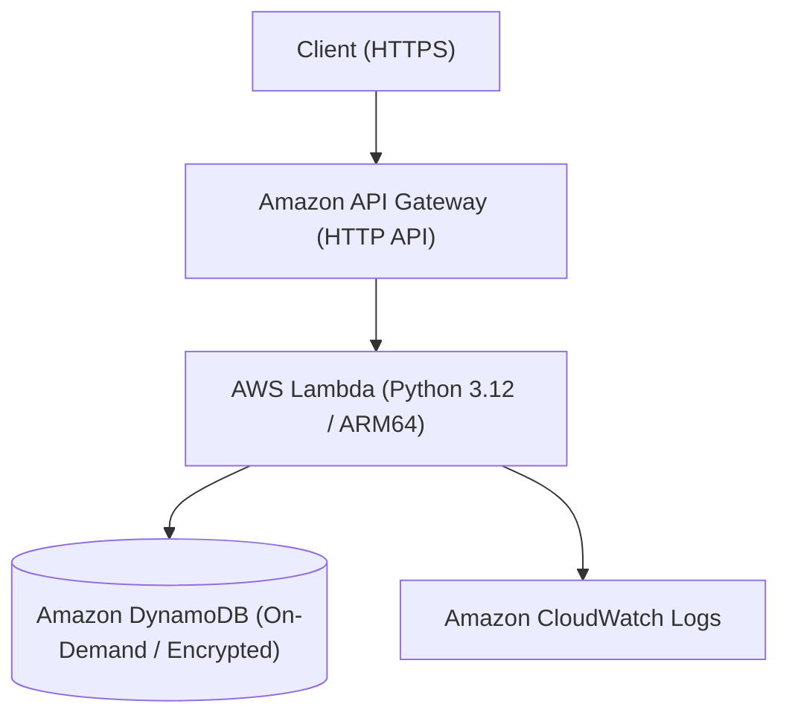

# Serverless REST Infra Forge

> 高可用・低コスト・完全サーバーレス。Terraform と AWS CDK の「二刀流」で挑む、次世代 RESTful API クラウドインフラ基盤。

---

## 🌟 プロジェクト概要

本プロジェクトは、AWSマネージドサービスのみで構成された高可用・低コスト・完全サーバーレスな RESTful API 基盤です。

最大の特徴は、**「Terraform」と「AWS CDK (TypeScript)」の二刀流構成**。
同一のインフラ仕様（API Gateway + Graviton Lambda + DynamoDB）を双方の IaC ツールで実装・管理可能にし、開発組織のスキルセットや運用要件に応じた柔軟な選択と徹底的な比較検証を実現しています。

### 🚀 インフラの主要ポイント
- **Amazon API Gateway (HTTP API)**: 低レイテンシ・低コスト・CORS標準対応のモダンエンドポイント
- **AWS Lambda (Python 3.12 / ARM64 Graviton)**: 高いコストパフォーマンスと最小権限 IAM による安全な実行環境
- **Amazon DynamoDB (On-Demand)**: 急激なトラフィック変動に自動追随し、PITR（ポイントインタイムリカバリ）と暗号化で本番データを死守
- **完全環境分離**: `dev`（開発）および `prd`（本番）をパラメータ注入でクリーンに分離
- **ステートフル保護**: 本番環境のテーブル誤削除を IaC レベルで防止（`deletion_protection` / `RemovalPolicy.RETAIN`）

---

## 🎨 インフラ構成図



---

## 📁 ディレクトリ構造

```text
serverless-rest-infra-forge/
├── terraform/
│   ├── environments/
│   │   ├── dev/
│   │   └── prd/
│   └── modules/
│       ├── apigateway/
│       ├── lambda/
│       └── dynamodb/
├── cdk/
│   ├── bin/
│   │   └── app.ts
│   ├── lib/
│   │   ├── constructs/
│   │   └── api-stack.ts
│   └── cdk.json
└── src/
    └── handler/
        └── index.py
```

---

## 🛠️ 展開手順

お好みの IaC ツールを選択してデプロイできます。

### A. Terraform での展開

```bash
# 1. 開発環境ディレクトリへ移動
cd terraform/environments/dev

# 2. 初期化
terraform init

# 3. 実行計画の確認
terraform plan

# 4. デプロイ実行
terraform apply
```

### B. AWS CDK での展開

```bash
# 1. CDK ディレクトリへ移動
cd cdk

# 2. 依存関係のインストール
npm install

# 3. 差分確認
npx cdk diff --context environment=dev

# 4. デプロイ実行
npx cdk deploy --context environment=dev
```

---

## 🎭 キャスト（制作クレジット）

AIアプリ工場劇場が誇る精鋭チームが、このインフラを創り上げました。

- **agent🔵（企画・要件定義）**: 「二刀流」サーバーレスAPI基盤の構想と要件定義書の策定
- **agent🍇（アーキテクチャ設計・検証）**: 非機能要件・セキュリティ設計およびIaC構造レビュー
- **agent🍊（爆速実装・リードエンジニア）**: Terraform モジュールおよび AWS CDK スタックの具現化
- **agent🟢（品質検証・セキュリティQA）**: IAM最小権限チェック・静的解析・IaC整合性検証
- **agent🟡（プロデュース）**: プロジェクト統括・リポジトリ公開プロデュース
